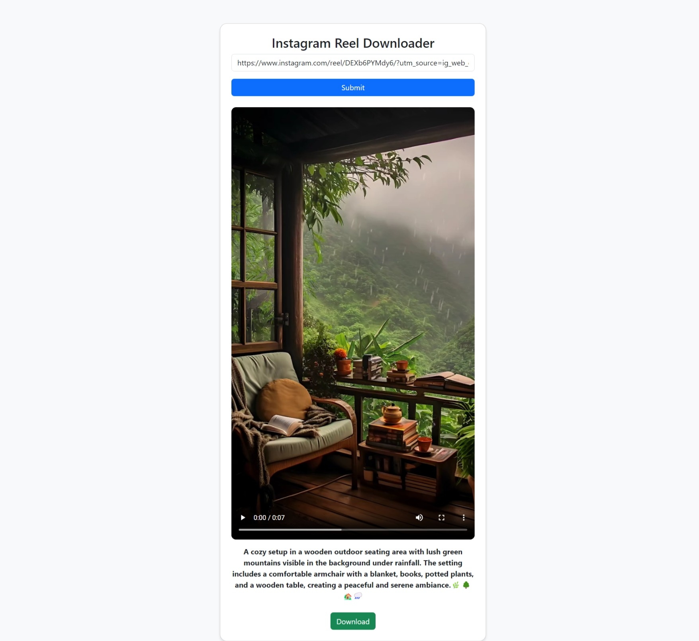

# Instagram Reel Downloader

A simple web application that allows users to download Instagram Reels using the [RapidAPI Download All in One API](https://rapidapi.com/uzapishop/api/instagram-downloader-download-instagram-videos-stories1). This project is built with PHP, JavaScript, HTML, and CSS.

## Features
- Fetch and download Instagram Reels.
- Simple and user-friendly UI.
- Uses RapidAPI for fetching media from Instagram.
- Supports video preview before downloading.

## Demo


## Technologies Used
- PHP (Backend)
- JavaScript (Frontend)
- Bootstrap (Styling)
- RapidAPI (Instagram Downloader API)

## Prerequisites
To run this project, you need:
- A web server (XAMPP, WAMP, or any hosting service that supports PHP).
- A RapidAPI account and subscription to the [Instagram Downloader API](https://rapidapi.com/uzapishop/api/instagram-downloader-download-instagram-videos-stories1).

## Installation

1. **Clone the repository**
   ```sh
   git clone https://github.com/TutorialsAndroid/Instagram-Reel-Downloader-Website.git
   cd instagram-reel-downloader
   ```

2. **Set up the API Key**
   - Open `index.php`
   - Replace `x-rapidapi-key` with your own RapidAPI key:
   ```php
   "x-rapidapi-key: YOUR_RAPIDAPI_KEY_HERE"
   ```

3. **Run the project**
   - If using a local server (e.g., XAMPP or WAMP), place the project in the `htdocs` folder and start Apache.
   - Open a web browser and go to:
     ```sh
     http://localhost/instagram-reel-downloader/
     ```

## Usage
1. Paste the Instagram Reel URL into the input field.
2. Click the **Submit** button.
3. Preview the video and click **Download** to save it to your device.

## File Structure
```
instagram-reel-downloader/
├── index.php      # Backend API request handling
├── index.html     # Frontend UI
├── index.js       # JavaScript for API calls and video handling
├── index.css      # Styling
├── README.md      # Project documentation
```

## Disclaimer
- This tool is for educational purposes only.
- Downloading content without permission may violate Instagram's terms of service.
- Use this tool responsibly.

## License
This project is licensed under the MIT License.

## Author
- **Akshay** - [GitHub Profile](https://github.com/TutorialsAndroid)

---
Feel free to contribute or report any issues!

